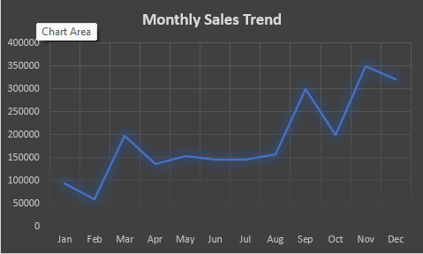
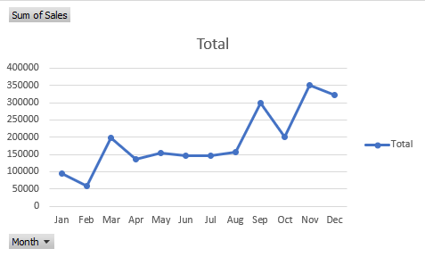

# Sales Data Analysis using Excel

## Project Overview
This project analyzes monthly sales data using Microsoft Excel to identify trends, patterns, and business insights.

## Tools Used
- Microsoft Excel
- Pivot Tables
- Data Cleaning
- Data Visualization

## Analysis Performed
- Month-wise total sales analysis
- Trend analysis using line charts
- Sales comparison using column charts

 ## 📊 Visual Insights

### Monthly Sales Trend

### Sales Comparison

## Key Insights
- Sales increase significantly from August onwards
- Highest sales observed in the last quarter (October–December)
- Early months show comparatively lower performance

## Conclusion
This project demonstrates practical Excel skills in data analysis and visualization and is suitable for entry-level Data Analyst roles.
